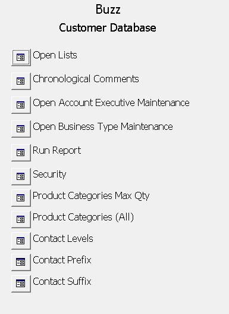
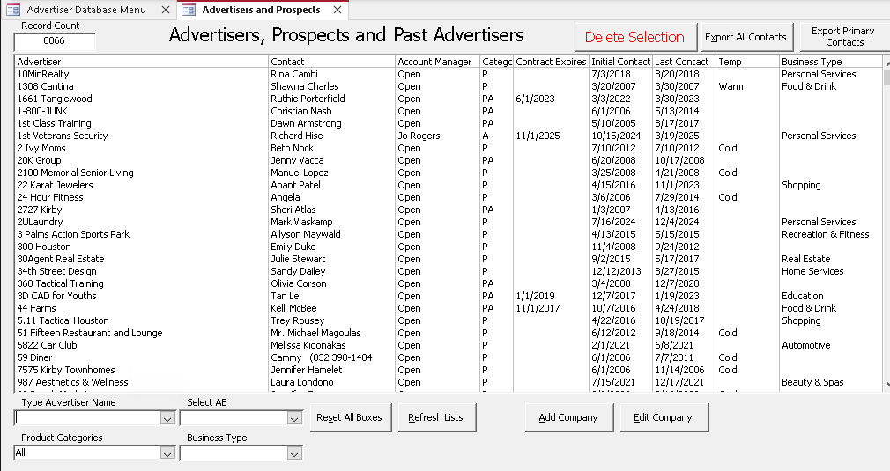
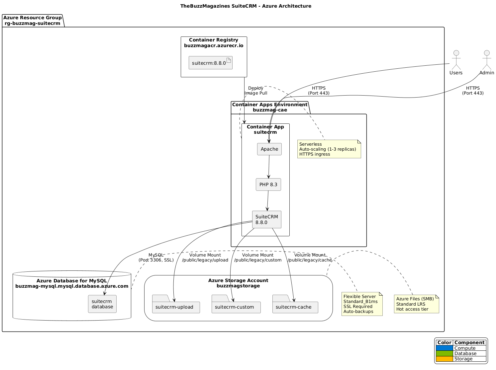

<p align="center">
  
</p>

<h1 align="center">TheBuzzMagazines CRM Migration Project</h1>

<p align="center">
  <strong>Modernizing a 20+ Year Legacy System to Cloud-Native Architecture</strong>
</p>

<p align="center">
  
  
  
  
  
</p>

---

## Introduction

**TheBuzzMagazines** is a comprehensive CRM migration project that transforms a legacy Microsoft Access database application into a modern, cloud-native Customer Relationship Management system powered by SuiteCRM and hosted on Microsoft Azure.

### The Challenge

The original system—a Microsoft Access database built over 20 years ago—has faithfully served the Buzz Magazines advertising sales team for decades. However, it faces critical limitations:

- **Single-user access** prevents team collaboration
- **No remote access** limits productivity
- **No automated backups** risks catastrophic data loss
- **Aging technology** makes maintenance increasingly difficult
- **No mobile support** in an increasingly mobile workforce

### The Solution

This project migrates the legacy data and workflows to **SuiteCRM 8.8**, a modern open-source CRM, deployed as a containerized application on **Azure Container Apps** with enterprise-grade security, automatic backups, and global accessibility.

---

## Table of Contents

| Section | Description |
|---------|-------------|
| [1. The Legacy System](#1-the-legacy-system) | The original MS Access application |
| [2. Architecture Overview](#2-architecture-overview) | Cloud-native design and data flow |
| [3. Technology Stack](#3-technology-stack) | Components and services used |
| [4. Azure Infrastructure](#4-azure-infrastructure) | Cloud resources and configuration |
| [5. Docker Container](#5-docker-container) | Container build and configuration |
| [6. Development Workflow](#6-development-workflow) | Scripts and automation |
| [7. Deployment Guide](#7-deployment-guide) | Step-by-step instructions |
| [8. Data Migration](#8-data-migration) | Legacy to SuiteCRM migration |
| [9. Security](#9-security) | Authentication and encryption |
| [10. Troubleshooting](#10-troubleshooting) | Common issues and solutions |
| [Documentation](#documentation) | Links to detailed guides |
| [Appendix A: Legacy Screenshots](#appendix-a-legacy-system-screenshots) | Complete visual tour of original system (36 images) |

---

## 1. The Legacy System

### A 20-Year Journey in Microsoft Access

The original **Buzz Advertisers Database** was built in Microsoft Access in the early 2000s. Despite its age, it remains fully functional and has been the backbone of the advertising sales operation for over two decades.

<p align="center">
  
  <br/>
  <em>The main menu of the original MS Access application</em>
</p>

### What the Legacy System Does

The Access database manages the complete advertising sales workflow:

| Module | Function |
|--------|----------|
| **Advertiser Management** | Track companies, contacts, and communication history |
| **Prospect Tracking** | Manage sales pipeline and lead status |
| **Account Executives** | Assign territories and track performance |
| **Product Categories** | Organize advertising offerings |
| **Reporting** | Generate sales reports and analytics |

### Advertiser and Prospects Management

The heart of the system is the advertiser management interface, where sales representatives track their accounts and prospects.

<p align="center">
  
  <br/>
  <em>Advertiser and prospects list view</em>
</p>

### Company Maintenance Forms

Detailed company information is managed through comprehensive data entry forms:

<p align="center">
  
  <br/>
  <em>The advertiser maintenance form with contact details and history</em>
</p>

### Reporting Dashboard

The system includes a reporting module for generating sales analytics and territory reports:

<p align="center">
  
  <br/>
  <em>Database report selection dashboard</em>
</p>

### Sample Report Output

Reports generate detailed listings by product category, account executive, and other criteria:

<p align="center">
  
  <br/>
  <em>All Product Categories report showing advertiser listings</em>
</p>

### Legacy System Limitations

| Limitation | Impact | Modern Solution |
|------------|--------|-----------------|
| Single-user file-based | No concurrent access | Multi-user web application |
| Local network only | No remote work capability | Cloud-hosted, accessible anywhere |
| No backups | Risk of data loss | Automated Azure backups |
| Windows-only | Platform locked | Cross-platform web access |
| No mobile access | Limited field sales | Responsive web design |
| Manual updates | Version control issues | Containerized deployments |

---

## 2. Architecture Overview

### Design Principles

The modernization follows cloud-native best practices:

```
┌─────────────────────────────────────────────────────────────────────────┐
│                          DESIGN PRINCIPLES                              │
├─────────────────────────────────────────────────────────────────────────┤
│  1. STATELESS CONTAINERS     No data stored in containers               │
│  2. ENVIRONMENT CONFIG       All settings via environment variables     │
│  3. CLOUD-NATIVE             Designed for serverless container hosting  │
│  4. PORTABLE                 Run locally or in Azure with same image    │
│  5. SECURE BY DEFAULT        SSL/TLS everywhere, no plain text secrets  │
└─────────────────────────────────────────────────────────────────────────┘
```

### Azure Architecture Diagram

<p align="center">
  
  <br/>
  <em>TheBuzzMagazines SuiteCRM Azure Architecture</em>
</p>

<sub>[View PlantUML source](./docs/puml/buzz_architecture.puml)</sub>

### High-Level Data Flow

```
                                    ┌─────────────────┐
                                    │      Users      │
                                    │  (Sales Team)   │
                                    └────────┬────────┘
                                             │ HTTPS
                                             ▼
┌────────────────────────────────────────────────────────────────────────────┐
│                        AZURE CONTAINER APPS                                │
│  ┌──────────────────────────────────────────────────────────────────────┐  │
│  │                     SuiteCRM Container                               │  │
│  │  ┌──────────────┐  ┌──────────────┐  ┌─────────────────────────────┐ │  │
│  │  │    Apache    │  │    PHP 8.3   │  │    SuiteCRM 8.8.0           │ │  │
│  │  │   (Port 80)  │──│   Runtime    │──│    Application              │ │  │
│  │  └──────────────┘  └──────────────┘  └─────────────────────────────┘ │  │
│  └──────────────────────────────────────────────────────────────────────┘  │
└────────────────────────────────────────────────────────────────────────────┘
           │                                                    │
           │ MySQL (SSL)                                        │ SMB
           ▼                                                    ▼
┌───────────────────────────┐                    ┌───────────────────────────┐
│  Azure MySQL Flexible     │                    │     Azure Files           │
│  ───────────────────────  │                    │   ─────────────────────   │
│  • suitecrm database      │                    │   • suitecrm-upload       │
│  • SSL/TLS encrypted      │                    │   • suitecrm-custom       │
│  • 7-day auto backups     │                    │   • suitecrm-cache        │
│  • Point-in-time restore  │                    │   • Hot tier storage      │
└───────────────────────────┘                    └───────────────────────────┘
```

### Development vs Production Architecture

| Component | Local Development | Azure Production |
|-----------|-------------------|------------------|
| Container Runtime | Docker Desktop | Azure Container Apps |
| Database | Azure MySQL (remote) | Azure MySQL Flexible Server |
| File Storage | Azure Files (SMB mount) | Azure Files (native mount) |
| Image Registry | Local Docker | Azure Container Registry |
| HTTPS | localhost:80 (HTTP) | Azure-managed HTTPS |

---

## 3. Technology Stack

### Container Stack

| Layer | Technology | Version | Purpose |
|-------|------------|---------|---------|
| **OS** | Debian | Bookworm | Base operating system |
| **Web Server** | Apache | 2.4.x | HTTP server with mod_rewrite |
| **Runtime** | PHP | 8.3 | Application runtime |
| **Application** | SuiteCRM | 8.8.0 | CRM platform |

### PHP Extensions

| Extension | Purpose |
|-----------|---------|
| `mysqli` | MySQL database connectivity |
| `pdo_mysql` | PDO MySQL driver |
| `gd` | Image processing (freetype, jpeg) |
| `zip` | Archive handling |
| `intl` | Internationalization |
| `xml` | XML processing |
| `opcache` | PHP bytecode caching |
| `imap` | Email integration |
| `bcmath` | Arbitrary precision mathematics |

### Azure Services

| Service | SKU | Purpose | Monthly Cost (Est.) |
|---------|-----|---------|---------------------|
| Container Apps | Consumption | Serverless container hosting | ~$15-50 |
| MySQL Flexible Server | Standard_B1s | CRM data storage | ~$12 |
| Storage Account | Standard LRS | File shares | ~$5 |
| Container Registry | Basic | Docker image repository | ~$5 |

**Estimated Total: ~$40-75/month**

### Development Tools

| Tool | Purpose |
|------|---------|
| Docker Desktop | Container runtime |
| Azure CLI | Azure resource management |
| cifs-utils | SMB mounting for Azure Files |
| MySQL Client | Database operations |
| Git | Version control |

---

## 4. Azure Infrastructure

### Resource Organization

All Azure resources are organized within a single resource group:

```
buzz-rg (Resource Group)
├── buzz-mysql (MySQL Flexible Server)
│   └── suitecrm (Database)
├── buzzmagstorage (Storage Account)
│   ├── suitecrm-upload (File Share)
│   ├── suitecrm-custom (File Share)
│   └── suitecrm-cache (File Share)
├── buzzacr (Container Registry)
└── buzz-cae (Container Apps Environment)
    └── suitecrm (Container App)
```

### MySQL Flexible Server Configuration

| Setting | Value | Notes |
|---------|-------|-------|
| **SKU** | Standard_B1s (Burstable) | 1 vCore, 1GB RAM |
| **Storage** | 20 GB | Auto-grow enabled |
| **Version** | 8.4 | Latest stable |
| **Backup** | 7-day retention | Geo-redundant optional |
| **SSL** | Required | Certificate-based |
| **Firewall** | Azure services + Dev IP | Configurable rules |

### Storage Account File Shares

| Share Name | Mount Path | Purpose |
|------------|------------|---------|
| `suitecrm-upload` | `/var/www/html/public/legacy/upload` | User uploaded files |
| `suitecrm-custom` | `/var/www/html/public/legacy/custom` | Custom modules/extensions |
| `suitecrm-cache` | `/var/www/html/public/legacy/cache` | Application cache |

### Container Apps Configuration

| Setting | Value |
|---------|-------|
| **Min Replicas** | 1 |
| **Max Replicas** | 3 |
| **CPU** | 0.5 cores |
| **Memory** | 1.0 GB |
| **Ingress** | External (HTTPS) |
| **Port** | 80 (container) |

---

## 5. Docker Container

### Container Architecture

```
┌─────────────────────────────────────────────────────────────────────┐
│                    DOCKER CONTAINER                                 │
├─────────────────────────────────────────────────────────────────────┤
│                                                                     │
│  ┌─────────────────────────────────────────────────────────────┐    │
│  │                      ENTRYPOINT SCRIPT                      │    │
│  │  • Generate config from environment variables               │    │
│  │  • Wait for database connection                             │    │
│  │  • Set permissions on mounted volumes                       │    │
│  └─────────────────────────────────────────────────────────────┘    │
│                               │                                     │
│                               ▼                                     │
│  ┌──────────────────┐  ┌──────────────────┐  ┌──────────────────┐   │
│  │     Apache       │  │      PHP 8.3     │  │   SuiteCRM 8.8   │   │
│  │   mod_rewrite    │──│   mysqli, gd     │──│   Core + Legacy  │   │
│  │   mod_headers    │  │   opcache, imap  │  │   Symfony-based  │   │
│  └──────────────────┘  └──────────────────┘  └──────────────────┘   │
│                                                                     │
│  ┌─────────────────────────────────────────────────────────────┐    │
│  │                    VOLUME MOUNTS                            │    │
│  │  /var/www/html/public/legacy/upload  → Azure Files          │    │
│  │  /var/www/html/public/legacy/custom  → Azure Files          │    │
│  │  /var/www/html/public/legacy/cache   → Azure Files          │    │
│  └─────────────────────────────────────────────────────────────┘    │
│                                                                     │
└─────────────────────────────────────────────────────────────────────┘
```

### Environment Variables

The container is configured entirely through environment variables:

| Variable | Required | Description |
|----------|----------|-------------|
| `SUITECRM_RUNTIME_MYSQL_HOST` | Yes | MySQL server hostname |
| `SUITECRM_RUNTIME_MYSQL_PORT` | No | MySQL port (default: 3306) |
| `SUITECRM_RUNTIME_MYSQL_NAME` | Yes | Database name |
| `SUITECRM_RUNTIME_MYSQL_USER` | Yes | Database username |
| `SUITECRM_RUNTIME_MYSQL_PASSWORD` | Yes | Database password |
| `SUITECRM_RUNTIME_MYSQL_SSL_ENABLED` | No | Enable SSL (default: true) |
| `SUITECRM_SITE_URL` | Yes | Public URL for SuiteCRM |
| `SUITECRM_LOG_LEVEL` | No | Logging level (default: warning) |
| `TZ` | No | Timezone (default: UTC) |

### Template-Driven Configuration

Docker configuration is fully driven by `.env` using template generation:

```
┌─────────────────────────────────────────────────────────────────────┐
│                    .env (Single Source of Truth)                    │
│  DOCKER_PHP_BASE_IMAGE=php:8.3-apache                               │
│  DOCKER_SUITECRM_VERSION=8.8.0                                      │
│  DOCKER_PHP_MEMORY_LIMIT=512M                                       │
│  DOCKER_CONTAINER_NAME=suitecrm-web                                 │
│  ...                                                                │
└─────────────────────────────────────────────────────────────────────┘
                                 │
                                 ▼  docker-generate.sh (envsubst)
┌────────────────────────────────┴────────────────────────────────────┐
│                                                                     │
│  Dockerfile.template          docker-compose.template.yml           │
│  ────────────────────         ───────────────────────────           │
│  FROM ${DOCKER_PHP_...}       container_name: ${DOCKER_...}         │
│  memory_limit = ${...}        ports: "${DOCKER_HOST_PORT}:..."      │
│                                                                     │
└─────────────────────────────────────────────────────────────────────┘
                                 │
                                 ▼  Generated (git-ignored)
┌────────────────────────────────┴────────────────────────────────────┐
│  Dockerfile                   docker-compose.yml                    │
│  ──────────                   ──────────────────                    │
│  Ready for docker build       Ready for docker compose up           │
└─────────────────────────────────────────────────────────────────────┘
```

**Key benefits:**
- Change PHP version, memory limits, or SuiteCRM version in ONE place (`.env`)
- No hardcoded values in Docker files
- Templates are committed; generated files are git-ignored
- Full flexibility to parameterize any value

### Docker Build Process

The image is built in stages for optimal caching:

```
Stage 1: Base Image (php:8.3-apache)
    ↓
Stage 2: System Dependencies (apt-get)
    ↓
Stage 3: PHP Extensions (docker-php-ext-install)
    ↓
Stage 4: Apache Configuration (mod_rewrite, SSL)
    ↓
Stage 5: PHP Configuration (memory, uploads, opcache)
    ↓
Stage 6: SuiteCRM Installation (download, extract)
    ↓
Stage 7: Entrypoint Script (runtime configuration)
    ↓
Final Image (~800MB)
```

---

## 6. Development Workflow

### Script-Based Automation

All operations are automated through scripts in the `scripts/` directory:

```
scripts/
├── cli.sh                         # Command-line interface
├── menu.sh                        # Interactive menu
├── validate-env.sh                # Environment validation
├── azure-provision-infra.sh       # Create Azure resources
├── azure-teardown-infra.sh        # Delete Azure resources
├── azure-validate-resources.sh    # Check resource status
├── azure-mount-fileshare-to-local.sh  # Mount Azure Files locally
├── azure-test-capabilities.sh     # Test Azure permissions
├── docker-generate.sh             # Generate Dockerfile from templates
├── docker-build.sh                # Build Docker image
├── docker-start.sh                # Start container
├── docker-stop.sh                 # Stop container
├── docker-validate.sh             # Check Docker status
└── docker-teardown.sh             # Remove Docker artifacts
```

### Local Development Workflow Order

**Critical:** Azure Files must be mounted BEFORE starting the container. The workflow order is:

```
┌─────────────────┐     ┌─────────────────┐     ┌─────────────────┐     ┌─────────────────┐
│ docker-generate │     │  docker-build   │     │   azure-mount   │     │  docker-start   │
│ ───────────────-│────▶│ ─────────────── │────▶│ ─────────────── │────▶│ ─────────────── │
│ Creates files   │     │ Builds image    │     │ Requires sudo   │     │ Requires mount  │
│ from templates  │     │ from generated  │     │ + Azure ready   │     │ for volumes     │
└─────────────────┘     └─────────────────┘     └─────────────────┘     └─────────────────┘
```

| Step | Script | Mount Required? | Notes |
|------|--------|-----------------|-------|
| 1 | `docker-generate` | No | Creates Dockerfile and docker-compose.yml from templates |
| 2 | `docker-build` | No | Builds the image (calls generate automatically) |
| 3 | `azure-mount` | N/A | Creates the mount points (requires sudo) |
| 4 | `docker-start` | **Yes** | Warns if mounts missing, allows override |
| 5 | `docker-validate` | No | Reports mount state in status |
| 6 | `docker-stop` | No | Just stops container |

**Why mounts matter:** The `docker-compose.yml` maps Azure Files to container paths:

```yaml
volumes:
  - /mnt/azure/suitecrm/upload:/var/www/html/public/legacy/upload
  - /mnt/azure/suitecrm/custom:/var/www/html/public/legacy/custom
  - /mnt/azure/suitecrm/cache:/var/www/html/public/legacy/cache
```

Without mounts, Docker creates empty local directories and **data will not persist** to Azure storage. The `docker-start.sh` script validates mounts and warns you if they're missing.

### Command Reference

**Azure Commands:**

| Command | Description |
|---------|-------------|
| `./scripts/cli.sh provision` | Create all Azure resources |
| `./scripts/cli.sh validate-resources` | Check Azure resource status |
| `./scripts/cli.sh mount` | Mount Azure Files locally (sudo) |
| `./scripts/cli.sh teardown` | Delete all Azure resources |

**Docker Commands:**

| Command | Description |
|---------|-------------|
| `./scripts/cli.sh docker-build` | Build the Docker image |
| `./scripts/cli.sh docker-start` | Start the container |
| `./scripts/cli.sh docker-stop` | Stop the container |
| `./scripts/cli.sh docker-validate` | Check Docker status |
| `./scripts/cli.sh docker-teardown` | Remove all Docker artifacts |

### Interactive Menu

For an interactive experience, run:

```bash
./scripts/menu.sh
```

```
┌─────────────────────────────────────────────────────────────────────┐
│                    THEBUZZMAGAZINES - MAIN MENU                     │
├─────────────────────────────────────────────────────────────────────┤
│                                                                     │
│   1. Environment        Validate .env, edit configuration           │
│   2. Azure Setup        Provision, mount, teardown Azure resources  │
│   3. Docker             Build, start, stop, validate containers     │
│   4. Database           Backup source database                      │
│   5. Logs               View script execution logs                  │
│   6. Quick Actions      Common workflow shortcuts                   │
│                                                                     │
│   0. Exit                                                           │
│                                                                     │
└─────────────────────────────────────────────────────────────────────┘
```

---

## 7. Deployment Guide

### Workflow Overview

```
┌─────────────┐     ┌─────────────┐     ┌─────────────┐     ┌─────────────┐
│   Step 1    │     │   Step 2    │     │   Step 3    │     │   Step 4    │
│  Configure  │────▶│  Provision  │────▶│   Build     │────▶│   Deploy    │
│    .env     │     │    Azure    │     │   Docker    │     │   & Test    │
└─────────────┘     └─────────────┘     └─────────────┘     └─────────────┘
```

### Step 1: Configure Environment

```bash
# Copy example configuration
cp .env.example .env

# Edit with your values
nano .env

# Validate configuration
./scripts/cli.sh validate-env
```

### Step 2: Provision Azure Resources

```bash
# Login to Azure
az login

# Run provisioning (creates MySQL, Storage, ACR)
./scripts/cli.sh provision

# Verify resources created
./scripts/cli.sh validate-resources
```

### Step 3: Build Docker Image

```bash
# Build the image
./scripts/cli.sh docker-build

# Mount Azure Files locally
sudo ./scripts/cli.sh mount

# Start the container
./scripts/cli.sh docker-start

# Validate everything is running
./scripts/cli.sh docker-validate
```

### Step 4: Access SuiteCRM

Open your browser to: **http://localhost**

Complete the SuiteCRM installation wizard, then lock the installer:

```bash
# Update .env
SUITECRM_INSTALLER_LOCKED=true

# Restart container
./scripts/cli.sh docker-stop
./scripts/cli.sh docker-start
```

---

## 8. Data Migration

### Migration Overview

The migration process transfers data from the legacy MS Access/MySQL database to SuiteCRM:

| Legacy Table | SuiteCRM Module | Notes |
|--------------|-----------------|-------|
| Advertisers | Accounts | Company records |
| AdvContacts | Contacts | Contact persons |
| Comments | Notes/Calls | Communication history |
| AcctExecs | Users | Sales representatives |
| Categories | Custom fields | Product categories |

### Migration Commands

```bash
# Backup source database first
./scripts/cli.sh backup-db-source pre_migration

# Migration scripts (to be developed)
# ./scripts/migrate-advertisers.sh
# ./scripts/migrate-contacts.sh
# ./scripts/migrate-history.sh
```

---

## 9. Security

### Encryption

| Layer | Encryption | Details |
|-------|------------|---------|
| **HTTPS** | TLS 1.2+ | Azure-managed certificates |
| **Database** | SSL Required | MySQL SSL connection mandatory |
| **Storage** | Azure Encryption | Server-side encryption at rest |
| **Secrets** | Environment Variables | Never stored in code |

### Access Control

- **Database**: Firewall rules restrict access to Azure services + developer IPs
- **Storage**: Shared access keys stored in `.azure-secrets` (git-ignored)
- **Container Registry**: Azure RBAC authentication
- **Application**: SuiteCRM role-based access control

### Credentials

| Username | Password | Contact |
|----------|----------|---------|
| manager | *(contact for pwd)* | adworkin@itprotects.com |
| buzz | *(contact for pwd)* | adworkin@itprotects.com |

---

## 10. Troubleshooting

### Common Issues

| Issue | Cause | Solution |
|-------|-------|----------|
| Container won't start | Image not built | Run `./scripts/cli.sh docker-build` |
| Database connection failed | MySQL not ready | Wait 1-2 minutes, check firewall rules |
| Mounts not working | Azure Files not mounted | Run `sudo ./scripts/cli.sh mount` |
| Permission denied | Wrong file ownership | Container sets permissions on start |
| 502 Bad Gateway | Container crashed | Check `docker compose logs` |

### Useful Commands

```bash
# Check all component status
./scripts/cli.sh docker-validate
./scripts/cli.sh validate-resources

# View container logs
docker compose logs -f

# Shell into container
docker compose exec web bash

# Check database connection
docker compose exec web php -r "new mysqli('host', 'user', 'pass', 'db');"
```

---

## Documentation

| Document | Description |
|----------|-------------|
| [ENV_GUIDE.md](./docs/ENV_GUIDE.md) | Environment variable reference |
| [SCRIPTS_GUIDE.md](./docs/SCRIPTS_GUIDE.md) | Script documentation |
| [MIGRATION_PROVISIONING_GUIDE.md](./docs/MIGRATION_PROVISIONING_GUIDE.md) | Detailed Azure provision/deploy guide |
| [DOCKER_GUIDE.md](./docs/DOCKER_GUIDE.md) | Docker build & deployment with .env-driven template generation |

---

## Appendix A: Legacy System Screenshots

This appendix provides a complete visual tour of the original Microsoft Access database application. Images are organized by functional module.

### A.1 Main Menu

The application entry point providing access to all modules.

| Image | Description |
|-------|-------------|
|  | **Main Menu** - Application entry point with navigation to all modules |

---

### A.2 Advertiser & Prospects Management

The core module for managing companies, contacts, and sales pipeline.

| # | Image | Description |
|---|-------|-------------|
| **Main Screen** | | |
| 2.0 | [View](./docs/images/legacy/02-00-advertiser_and_prospects_list.png) | Advertiser and Prospects List - Main listing of all companies |
| **Maintenance Form** | | |
| 2.a | [View](./docs/images/legacy/02-a-advertiser_maintenance_form.png) | Advertiser Maintenance Form - Detailed company record |
| 2.a.1 | [View](./docs/images/legacy/02-a-01-export_all_contacts.png) | Export All Contacts dialog |
| 2.a.2 | [View](./docs/images/legacy/02-a-02-export_primary_contacts.png) | Export Primary Contacts dialog |
| 2.a.3 | [View](./docs/images/legacy/02-a-03-add_company_form.png) | Add Company Form |
| 2.a.4 | [View](./docs/images/legacy/02-a-04-edit_company_form.png) | Edit Company Form |
| **Dropdown Fields** | | |
| 2.a.5 | [View](./docs/images/legacy/02-a-05-primary_dropdown.png) | Primary Contact dropdown |
| 2.a.6 | [View](./docs/images/legacy/02-a-06-category_dropdown.png) | Category dropdown |
| 2.a.7 | [View](./docs/images/legacy/02-a-07-temperature_dropdown.png) | Temperature (lead status) dropdown |
| 2.a.8 | [View](./docs/images/legacy/02-a-08-unnamed_field_next_to_website_dropdown_which_is_company_type.png) | Company Type dropdown |
| 2.a.9 | [View](./docs/images/legacy/02-a-09-contact_level_dropdown.png) | Contact Level dropdown |
| 2.a.10 | [View](./docs/images/legacy/02-a-10-contract_type_dropdown.png) | Contract Type dropdown |
| 2.a.11 | [View](./docs/images/legacy/02-a-11-comment_ae_textselector_list.png) | Comment AE Text Selector |
| **Search/Filter Controls** | | |
| 2.b | [View](./docs/images/legacy/02-b-type_advertiser_name_textselector_list.png) | Type Advertiser Name search |
| 2.c | [View](./docs/images/legacy/02-c-select_ae_dropdown.png) | Select Account Executive filter |
| 2.d | [View](./docs/images/legacy/02-d-product_categories_dropdown.png) | Product Categories filter |
| 2.e | [View](./docs/images/legacy/02-e-business_type_dropdown.png) | Business Type filter |

---

### A.3 Chronological Comments

Communication history and notes tracking.

| # | Image | Description |
|---|-------|-------------|
| **Main Screen** | | |
| 3.0 | [View](./docs/images/legacy/03-00-chronological_comments.png) | Chronological Comments - Communication history listing |
| **Controls** | | |
| 3.a | [View](./docs/images/legacy/03-a-type_advertiser_name_textselector_list.png) | Type Advertiser Name search |
| 3.b | [View](./docs/images/legacy/03-b-select_ae_dropdown.png) | Select Account Executive filter |
| 3.c | [View](./docs/images/legacy/03-c-product_categories_dropdown.png) | Product Categories filter |
| 3.d | [View](./docs/images/legacy/03-d-export_data_failed_error.png) | Export Data Error dialog |

---

### A.4 Account Executive Maintenance

Sales representative management.

| # | Image | Description |
|---|-------|-------------|
| 4.0 | [View](./docs/images/legacy/04-00-account_executive_maintenance_list.png) | Account Executive Maintenance - List of sales representatives |

---

### A.5 Business Type Maintenance

Company classification categories.

| # | Image | Description |
|---|-------|-------------|
| 5.0 | [View](./docs/images/legacy/05-00-business_type_maintenance_list.png) | Business Type Maintenance - Industry/business categories |

---

### A.6 Database Reports

Report generation dashboard and output.

| # | Image | Description |
|---|-------|-------------|
| **Main Screen** | | |
| 6.0 | [View](./docs/images/legacy/06-00-run_database_report_dashboard.png) | Run Database Report Dashboard - Report selection interface |
| **Report Options & Output** | | |
| 6.a | [View](./docs/images/legacy/06-a-all_product_categories_notification.png) | All Product Categories notification |
| 6.b | [View](./docs/images/legacy/06-b-one_account_executive_dropdown.png) | One Account Executive dropdown selector |
| 6.c | [View](./docs/images/legacy/06-c-all_product_categories_report.png) | All Product Categories Report output |

---

### A.7 Security / User Management

Application access control.

| # | Image | Description |
|---|-------|-------------|
| 7.0 | [View](./docs/images/legacy/07-00-buzz_security_list.png) | Buzz Security List - User accounts and permissions |

---

### A.8 Product Categories (Max Quantity)

Advertising product inventory limits.

| # | Image | Description |
|---|-------|-------------|
| 8.0 | [View](./docs/images/legacy/08-00-product_categories_max_qty_list.png) | Product Categories Max Qty - Inventory limits by category |

---

### A.9 All Product Categories

Complete product catalog.

| # | Image | Description |
|---|-------|-------------|
| 9.0 | [View](./docs/images/legacy/09-00-all_product_categories_list.png) | All Product Categories - Complete product listing |

---

### A.10 Contact Levels

Contact hierarchy/importance classification.

| # | Image | Description |
|---|-------|-------------|
| 10.0 | [View](./docs/images/legacy/10-00-contact_levels_list.png) | Contact Levels - Decision maker hierarchy |

---

### A.11 Contact Prefix

Salutation prefixes (Mr., Mrs., Dr., etc.).

| # | Image | Description |
|---|-------|-------------|
| 11.0 | [View](./docs/images/legacy/11-00-contact_prefix.png) | Contact Prefix - Name salutations |

---

### A.12 Contact Suffix

Name suffixes (Jr., Sr., III, etc.).

| # | Image | Description |
|---|-------|-------------|
| 12.0 | [View](./docs/images/legacy/12-00-contact_suffix.png) | Contact Suffix - Name suffixes |

---

### Legacy System Image Summary

| Module | Main Screen | Sub-Images | Total |
|--------|-------------|------------|-------|
| Main Menu | 1 | 0 | 1 |
| Advertiser & Prospects | 1 | 17 | 18 |
| Chronological Comments | 1 | 4 | 5 |
| Account Executive Maintenance | 1 | 0 | 1 |
| Business Type Maintenance | 1 | 0 | 1 |
| Database Reports | 1 | 3 | 4 |
| Security | 1 | 0 | 1 |
| Product Categories Max Qty | 1 | 0 | 1 |
| All Product Categories | 1 | 0 | 1 |
| Contact Levels | 1 | 0 | 1 |
| Contact Prefix | 1 | 0 | 1 |
| Contact Suffix | 1 | 0 | 1 |
| **Total** | **12** | **24** | **36** |

---

## License

This project is proprietary software. See [LICENSE](./LICENSE) for details.

---

<p align="center">
  <strong>TheBuzzMagazines</strong> - Modernizing Sales CRM for the Digital Age
  <br/>
  <sub>Built with SuiteCRM, Docker, and Microsoft Azure</sub>
</p>
